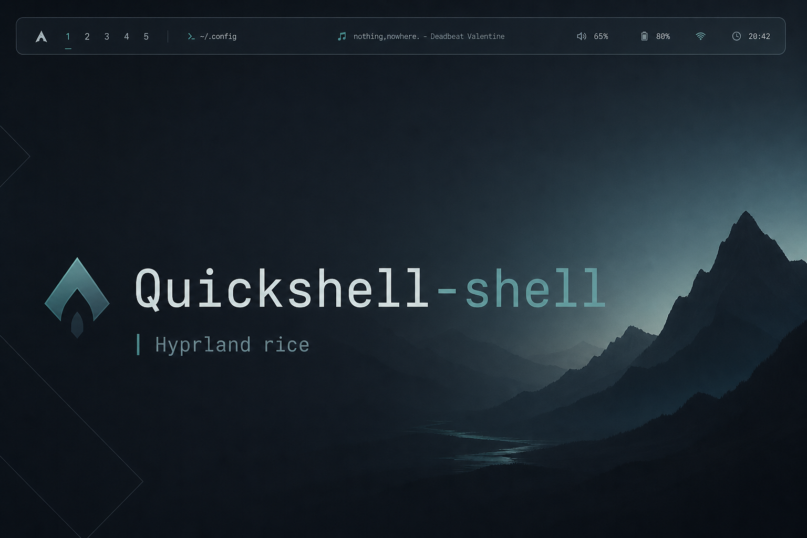
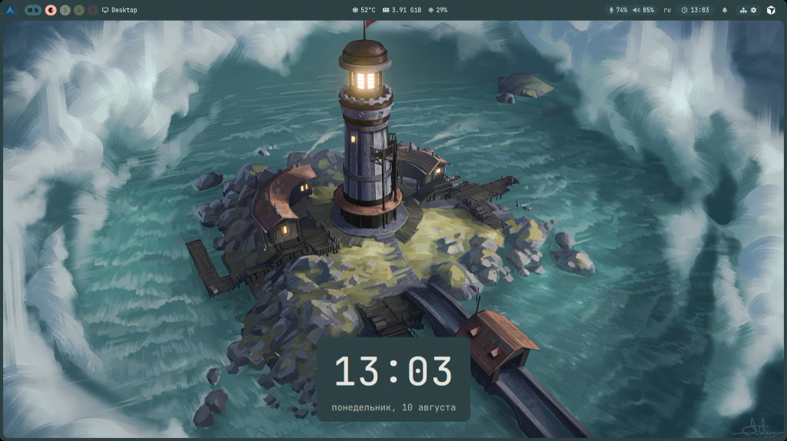

<p align="center">
  
</p>

<h1 align="center">Quickshell-shell</h1>

<p align="center">
  <b>Hyprland rice</b> with a polished <b>Quickshell</b> bar, lock screen, dashboard,<br/>
  Control panel (Wi‑Fi / Bluetooth / clipboard), launcher &amp; power menu —<br/>
  plus <b>Kitty</b>, <b>Yazi</b>, <b>Fish</b> &amp; <b>Starship</b>.
</p>

<p align="center">
  
  
  
</p>

---

## Preview

<p align="center">
  
</p>

| Layer | What you get |
|--------|----------------|
| **Hyprland** | Binds, autostart (`qs` + lock), decorations, window rules |
| **Quickshell** | Top bar, Control panel, dashboard, launcher, lock (no hyprlock), wallpapers + live theme |
| **Control** | Wi‑Fi (NetworkManager), Bluetooth (PIN pair UI), clipboard history (cliphist), wallpapers, shortcuts |
| **Kitty** | Terminal + wallpaper-linked colors |
| **Yazi** | File manager theme hooks |
| **Fish + Starship** | Shell + prompt (palette can follow wallpaper) |

> Wallpapers (~550 MB) ship as a **GitHub Release** asset — not inside the git clone — so the repo stays light.

---

## Requirements

- **Arch Linux** (recommended) with `sudo` + internet  
- Wayland session capable of running **Hyprland**  
- Optional AUR helper (`yay` / `paru`) for **Bibata** cursor theme  
- On other distros: install the same packages yourself, then use `./install.sh --configs-only`

Optional: [hyprglass](https://github.com/) via `hyprpm` (config already guards with `if hl.plugin.hyprglass`).

---

## Install (follow in order)

### 1) Clone

```bash
cd ~
git clone https://github.com/FerrSa17/Quickshell-shell.git
cd Quickshell-shell
```

### 2) Packages + configs + wallpapers

```bash
./install.sh
```

Wallpapers download by default from:

```text
https://github.com/FerrSa17/Quickshell-shell/releases/latest/download/wallpapers.tar.zst
```

Override if needed:

```bash
export WALLPAPERS_URL="https://github.com/FerrSa17/Quickshell-shell/releases/latest/download/wallpapers.tar.zst"
./install.sh
```

What it does:

1. `pacman` installs Hyprland, Quickshell, Kitty, Yazi, Fish, Starship, awww, **cliphist**, **wl-clipboard**, **NetworkManager**, **bluez**, fonts, Python BT agent deps, tools…  
2. Enables `NetworkManager` + `bluetooth` services  
3. Backs up existing `~/.config/{quickshell,hypr,kitty,yazi,starship}` (+ `fish/config.fish`)  
4. Copies rice configs in place (scripts marked executable)  
5. Downloads & extracts wallpapers into `~/Wallpaper/{Light,Dark,Calm}`  
6. Offers to set **fish** as your login shell  
7. Runs a quick self-check for critical files / commands  

Step-by-step alternatives:

```bash
./install.sh --packages-only
./install.sh --configs-only
./install.sh --wallpapers-only
```

### 3) Reboot

```bash
systemctl reboot
```

Log into **Hyprland**. Quickshell starts from Hyprland autostart (bar + session lock).

---

## First minutes after reboot

| Action | Binding |
|--------|---------|
| Dashboard | `Super + A` |
| App launcher | `Super + W` |
| Power menu | `Super + P` |
| System monitor | `Super + Shift + A` |
| Screenshot | `Super + S` |
| Terminal | `Super + Return` |
| Control panel | gear on the bar |
| Clipboard history | clipboard icon on the bar |
| Shortcuts cheatsheet | Control → **Shortcuts** |

Unlock the lock screen with your **Linux user password** (PAM `login` — **hyprlock package not required**).

---

## Publishing wallpapers (maintainer)

On the machine that has `~/Wallpaper`:

```bash
./pack-wallpapers.sh
# → dist/wallpapers.tar.zst
```

Create / update a GitHub **Release** and upload `dist/wallpapers.tar.zst` as asset name:

```text
wallpapers.tar.zst
```

Then installers pull:

```text
https://github.com/FerrSa17/Quickshell-shell/releases/latest/download/wallpapers.tar.zst
```

For local testing without GitHub:

```bash
WALLPAPERS_URL="file://$HOME/Quickshell-shell/dist/wallpapers.tar.zst" ./install.sh --wallpapers-only
```

---

## Other distros

1. Install equivalents of the Arch packages listed in `install.sh` (`PAC_PKGS` + AUR cursor).  
2. Run `./install.sh --configs-only`  
3. Fetch wallpapers with `./install.sh --wallpapers-only` (or set `WALLPAPERS_URL`)  
4. Enable NetworkManager + bluetooth, and Hyprland in your display manager  

---

## Layout

```text
Quickshell-shell/
├── README.md
├── install.sh
├── pack-wallpapers.sh
├── assets/screenshots/
├── configs/
│   ├── quickshell/          # bar, lock, Control, scripts/
│   ├── hypr/
│   ├── kitty/
│   ├── yazi/
│   ├── fish/
│   └── starship/
└── dist/                    # local wallpaper archive (gitignored)
```

Notable Quickshell pieces:

- `NetRadio.qml` / `BtRadio.qml` / `RadioPanel.qml` — Wi‑Fi & Bluetooth in Control  
- `ClipboardHistory.qml` / `ClipboardCenter.qml` — pin-able clipboard history  
- `scripts/bt-pair.py` — BlueZ agent for PIN pairing  
- `scripts/apply-wallpaper-theme.sh` — live palette from wallpaper  

---

## Notes

- Existing configs are copied to `~/.config-backup-quickshell-shell-<timestamp>/` before overwrite.  
- `colors.json` is generated at runtime from wallpapers — not shipped.  
- Brightness uses **ddcutil** (external monitors) and **brightnessctl** where available.  
- Nerd Font icons: install `ttf-jetbrains-mono-nerd` (bar glyphs). Icon theme: **Papirus**.  
- Add more screenshots under `assets/screenshots/` anytime and link them here.

---

<p align="center">
  <sub>Built for daily driving Arch + Hyprland. PRs and rice tweaks welcome.</sub>
</p>
